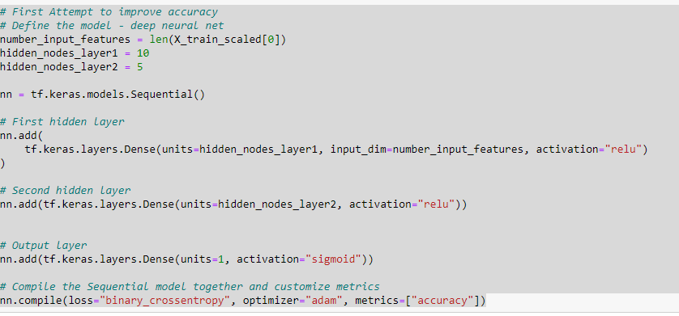

# Neural_Network_Charity_Analysis

## Overview of the Analysis
  This challenge's purpose was to use TensorFlow and design a deep learning model or neural network to predict if an Alphabet Soup Funded organiztion would be successful according to the Dataset.
  
## Results
* Data Preprocessing
The target variable for this model was the "IS_SUCCESSFUL" Column.
The feature variables for this model were all columns other than the target variable and dropped variables.
The EIN and NAME variables were dropped from the dataset as they had no impact on the outcome of the analysis.

* Compiling, Training, and Evaluating the Model

There were 2 layers that were hidden, the first layer had 80 neurons, the second had 30 neurons.

The model was not very accurate at 54%. Therefore additional steps were taken to further train the model.  This included adding another layer, and decreasing the number of neurons in each layer.

## Summary
It seems as if the first addtional training attempt created the most accurate analysis at 72% 

For this model I included just 2 hidden layers, it is possible that the other models overtrained the data. 

